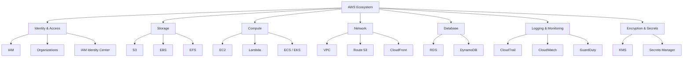
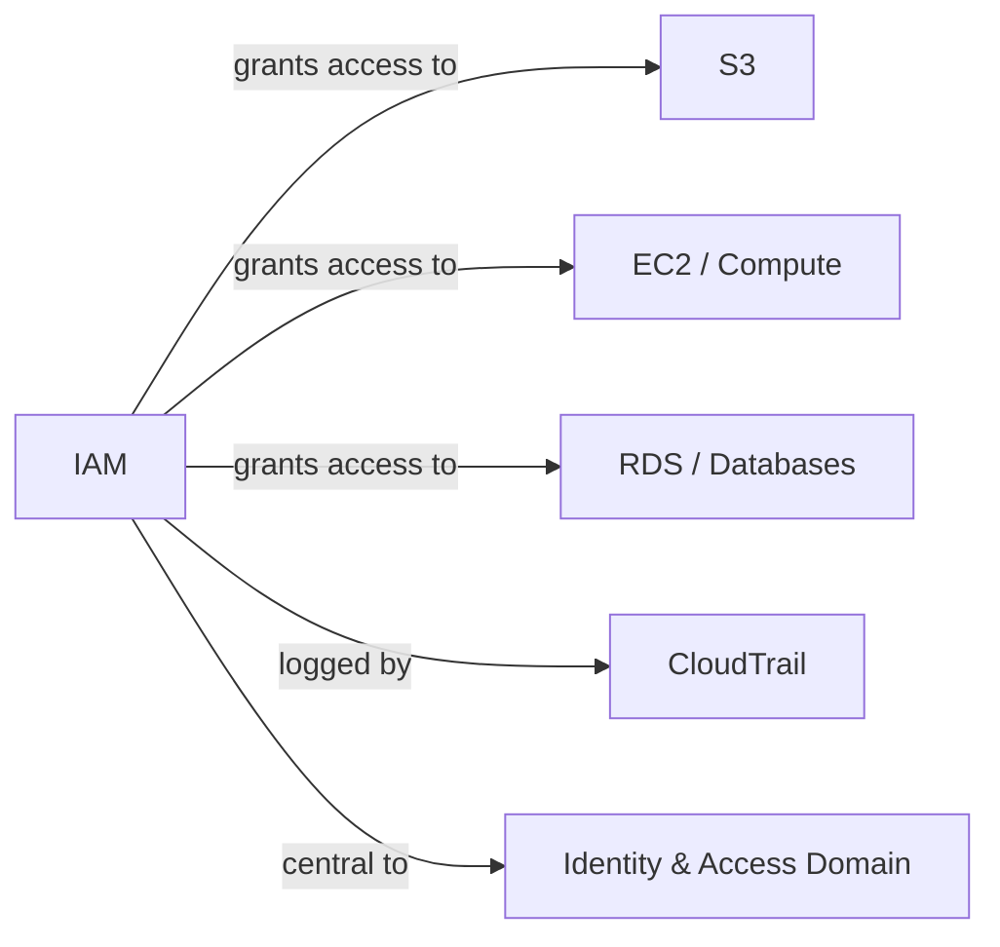
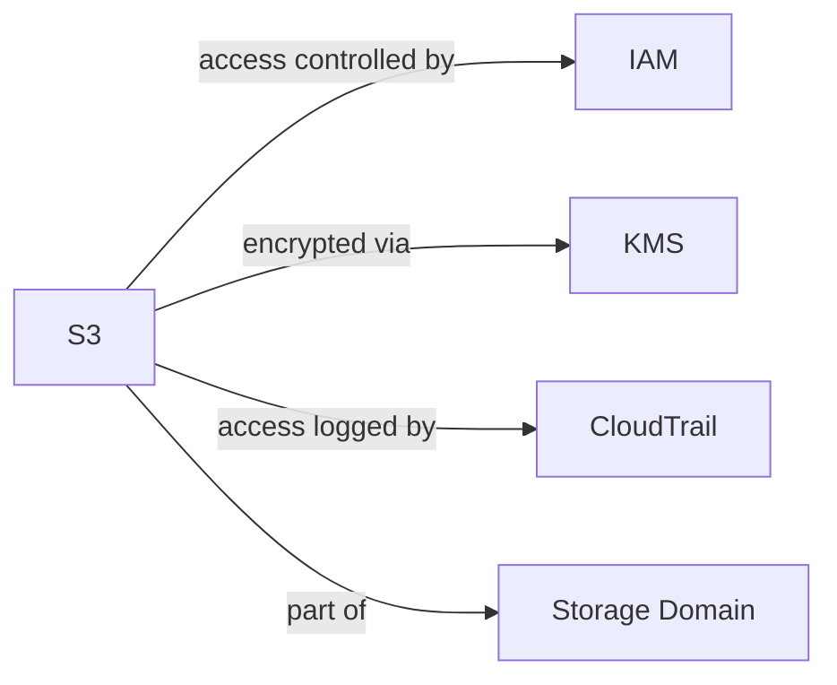

# AWS Security Cheat Sheet

**Sections:** [IAM](#iam-common-attacks) · [S3](#s3-common-attacks)

Purple-team style: each entry pairs the attack vector with the mitigation, so the same doc works for offense and defense.

## AWS Security Domain Map



---

## IAM Common Attacks



**Title:** IAM Over-Permissioned Policies

**Risk:** IAM policies granting broader permissions than needed — especially combinations of specific permissions that enable privilege escalation — let an attacker with limited initial access expand to full administrative control. This is not a theoretical edge case: Unit 42 research found 99% of cloud identities (users, roles, service accounts) across 18,000 analyzed accounts are overly permissive.

**Common Attacks Performed:**
- **PassRole + compute service abuse.** `iam:PassRole` combined with the ability to launch a compute service (Lambda, EC2, ECS) lets an attacker pass a stronger role to a new instance/function, then retrieve that role's credentials from the service's metadata.
  ```
  aws ec2 run-instances --iam-instance-profile Name=<privileged-role> --image-id <ami>
  # then, from the instance:
  curl http://169.254.169.254/latest/meta-data/iam/security-credentials/<privileged-role>
  ```
- **Policy version hijacking.** `iam:CreatePolicyVersion` on a shared policy lets an attacker write a new, more permissive version and set it as default — silently over-privileging everyone attached to that policy, not just themselves.
- **Direct self-escalation.** Permissions like `iam:AttachUserPolicy`, `iam:AttachRolePolicy`, or `iam:PutRolePolicy` let an attacker attach `AdministratorAccess` directly to their own identity, or write an inline policy granting themselves anything.
  ```
  aws iam attach-user-policy --user-name <self> --policy-arn arn:aws:iam::aws:policy/AdministratorAccess
  ```

**Mitigation:**
- Run automated escalation-path detection (AWS IAM Access Analyzer, Cloudsplaining, PMapper) and enforce Service Control Policies at the Organizations level that explicitly deny dangerous actions (`iam:CreatePolicyVersion`, `iam:AttachUserPolicy`, `iam:PassRole`) outside of controlled break-glass paths.
- Apply permission boundaries so an identity's maximum possible permissions are capped regardless of what policy gets attached later. *[CONTESTED: some practitioners consider permission boundaries added complexity that isn't worth it for smaller AWS environments, preferring simpler SCP-only enforcement.]*
  - Contested source: [dev.to — AWS IAM Security Best Practices 2026](https://dev.to/karaniph/aws-iam-security-best-practices-in-2026-a-complete-guide-o14) (argues for simplified layered controls over boundary-heavy setups in smaller orgs)
- Scope permissions to specific resource ARNs instead of wildcard `*` resources, and monitor for high-risk actions (`iam:CreateAccessKey`, `iam:AttachUserPolicy`) via EventBridge or GuardDuty custom threat intel.

**Severity:** *Pending — not yet scored. Per this project's own process, severity is a collaborative checkpoint, not an autonomous AI rating; needs to be worked through together, not backfilled during extraction.*

**Sources:**
- [AWS IAM Privilege Escalation: All 21 Methods Explained](https://medium.com/@mtsboysquad001/aws-iam-privilege-escalation-all-21-methods-explained-with-practical-commands-89ff85f53541)
- [Unit 42 — IAM-Deescalate](https://unit42.paloaltonetworks.com/iam-deescalate/)
- [RhinoSecurityLabs — AWS IAM Privilege Escalation](https://github.com/RhinoSecurityLabs/AWS-IAM-Privilege-Escalation)

---

## S3 Common Attacks



**Title:** S3 Over-Permissioning Risk

**Risk:** Misconfigured bucket policies or ACLs — especially wildcard principals (`Principal: *`) or overly broad actions/resources — expose buckets to public access. Legacy ACLs are a common blind spot, often overlooked in security reviews despite still being active.

**Common Attacks Performed:**
- **Public exposure via permissive policy/ACL.** A bucket policy or ACL with a wildcard principal or overly broad actions/resources makes the bucket reachable by anyone, not just intended users.
- **Post-exposure exploitation.** Exposure isn't just read access — a misconfigured bucket can allow an attacker to *modify* content and permissions, enabling malicious file injection (defacement, malware hosting), exfiltration of sensitive files or database backups, or repurposing the bucket as a C2 server for a malware campaign.

**Mitigation:**
- Enable S3 Block Public Access at the account and bucket level.
- Audit bucket policies/ACLs for wildcard principals or actions — don't rely on manual review alone; run automated over-permission detection across the environment.
- Enforce encryption at rest and in transit, and enable S3 access logging to track who's accessing what.

**Severity:** *Pending — not yet scored, same reasoning as the IAM entry above.*

**Sources:**
- [AWS Security Blog — Securing your Amazon S3 buckets](https://aws.amazon.com/blogs/security/securing-your-amazon-s3-buckets-identifying-and-remediating-over-permissioned-access/)
- [Qualys — Amazon S3 Bucket Security Risks](https://blog.qualys.com/vulnerabilities-threat-research/2023/12/18/hidden-risks-of-amazon-s3-misconfigurations)

---

## Cross-Service Attacks

*(none documented yet — this section is reserved for attack chains that span multiple services, e.g. an S3 misconfiguration combined with IAM privilege escalation. Per this project's process: cross-service attack-path diagrams pause for consultation if a clean diagram isn't achievable, rather than forcing a low-confidence one through.)*
